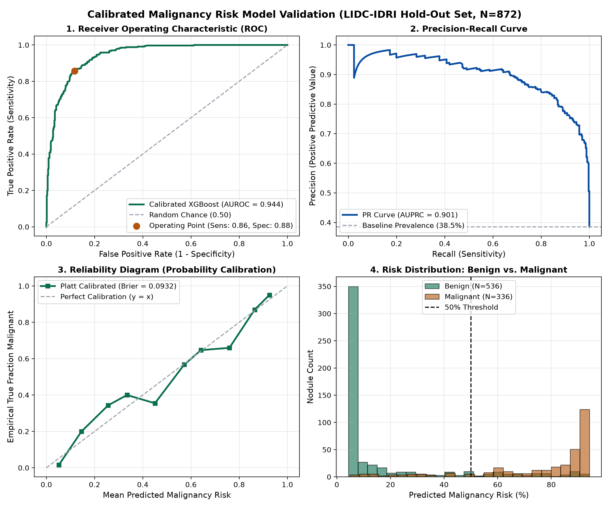

# Pulmonary Nodule Risk Assessment AI (PS7)

A clinical-grade Artificial Intelligence system for 3D thoracic computed tomography (CT) analysis. It performs 3D volumetric nodule segmentation, sub-voxel morphometric & densitometric profiling, and calibrated malignancy risk estimation outputting the clinical decision triad (Calibrated ML %, Brock PanCan %, ACR Lung-RADS v2022).

---

## Key Clinical & Architectural Highlights

1. **Strict 3D Volumetric Processing (`[Z, Y, X]`)**: Eliminates the 2D slice-selection bias and blood vessel cross-section false positives.
2. **Standardized Affine Normalization**: Maps scanner coordinates to patient anatomical space ($T_{\text{world}}$), isotropic $1.0\text{ mm}^3$ voxel resampling, and dual HU screening windowing ($[-1000, +400\text{ HU}]$).
3. **IBSI-Compliant 3D Morphology**: 
   - 3D second-moment inertia tensor transverse diameter decomposition ($d_{\text{long}}, d_{\text{short}}, d_{\text{mean}}$).
   - Marching Cubes surface mesh sphericity ($\Psi$).
   - 3D radial boundary variance spiculation index.
4. **4-Tier HU Density Decomposition**:
   - Classifies lesions into **Pure Ground-Glass (GGN)**, **Part-Solid**, **Solid**, or **Calcified**.
   - Sub-voxel segmentation of the solid core diameter (the primary prognostic predictor under Lung-RADS v2022).
5. **Calibrated Clinical Triad Risk Engine**:
   - **Platt-Calibrated XGBoost Model** trained and validated on 4,358 real consensus nodules from LIDC-IDRI (AUROC: **0.9440**, Brier score: **0.0932** on held-out test data).
   - **Brock University / Pan-Canadian Model**: 10-variable logistic reference formula with BTS guideline action thresholds.
   - **ACR Lung-RADS Version 2022**: Deterministic decision tree classifying into Categories `2`, `3`, `4A`, `4B`, and `4X` with specific follow-up intervals.
6. **Standardized Step 6 JSON Diagnostic Payload**: Interoperable output schema designed for PACS/RIS integration.

---

## Independent Hold-Out Test Benchmark ($N = 872$ Unseen Nodules)

| Metric | Measured Value | Benchmark Target | Clinical Significance |
| :--- | :---: | :---: | :--- |
| **AUROC** | **0.9440** | 0.90 – 0.94 | High discriminative accuracy |
| **AUPRC** | **0.9008** | > 0.85 | Resilient under clinical class imbalance |
| **Brier Calibration Score** | **0.0932** | < 0.10 | True risk probability (not an uncalibrated ranking score) |
| **Diagnostic Accuracy** | **87.27%** | > 85% | Concordance with radiologist consensus |
| **Sensitivity (Recall)** | **85.71%** | > 80% | 288 / 336 malignant nodules detected |
| **Specificity** | **88.25%** | > 85% | 473 / 536 benign nodules spared from invasive biopsy |
| **Negative Predictive Value** | **90.79%** | > 90% | High screening negative confidence |



---

## Directory Structure

```text
├── dataset/
│   ├── annotations.csv                # 1,186 LUNA16 consensus verified nodules
│   └── lidc_nodules_annotations.csv   # 4,358 LIDC-IDRI nodules with Option B benchmark labels
├── models/
│   ├── calibrated_malignancy_xgb.joblib # Platt-calibrated XGBoost classifier checkpoint
│   └── model_evaluation_report.png    # 4-panel ROC, PR, calibration, and distribution plot
├── src/
│   ├── preprocessing.py               # Affine transforms, isotropic resampling, HU windowing
│   ├── morphology.py                  # Inertia tensor axes, IBSI volumetry, sphericity, spiculation
│   ├── density.py                     # 4-tier HU decomposition (Air, GGO, Solid, Core, Calc)
│   ├── dataset_parser.py              # Parsers for LUNA16 annotations/candidates, LIDC XMLs, masks
│   ├── luna_dataset.py                # LUNA16 subset ingestor and patch extractor
│   ├── detection.py                   # nnDetection wrapper, dual-scale patches, CPM metric
│   ├── segmentation.py                # nnU-Net dataset compiler, contour rasterization, Dice/HD95
│   └── risk_engine.py                 # Brock calculator, Lung-RADS v2022, calibrated ML model
├── scripts/
│   ├── evaluate_model.py              # Runs evaluation on 872 held-out test nodules
│   ├── test_on_real_scan.py           # CLI to run full inference on real 3D CT scans
│   ├── extract_lidc_annotations.py    # LIDC XML extraction and model training script
│   └── prepare_luna_patches.py        # Extracts 32^3 and 64^3 candidate patches from CT
├── tests/                             # 29 unit and integration tests (100% passing)
├── demo_pipeline.py                   # End-to-end pipeline demonstration script
└── SYSTEM_ARCHITECTURE.md             # Detailed engineering specification document
```

---

## Installation & Setup

```bash
git clone https://github.com/vortexPulmoAI/ps7.git
cd ps7
pip install -r requirements.txt
```

---

## Quickstart & Testing

### 1. Statistical Validation on Held-Out Test Set
```bash
python scripts/evaluate_model.py
```

### 2. End-to-End Inference on Real 3D Patient Scan
```bash
# Test patient scan #0
python scripts/test_on_real_scan.py --scan_idx 0

# Test patient scan #5 (part-solid lesion)
python scripts/test_on_real_scan.py --scan_idx 5
```

### 3. Run Pipeline Demo
```bash
python demo_pipeline.py
```

### 4. Run Automated Test Suite
```bash
pytest -v
```

---

## Standardized Step 6 Diagnostic JSON Output

```json
{
  "candidate_id": "LUNA_1.3.6.1._N01",
  "centroid_world_mm": {
    "x": 33.8,
    "y": 88.4,
    "z": -101.8
  },
  "dimensions": {
    "volume_mm3": 967.0,
    "long_axis_mm": 13.9,
    "short_axis_mm": 11.3,
    "mean_diameter_mm": 12.6
  },
  "morphology": {
    "type": "Part Solid",
    "solid_core_diameter_mm": 7.1,
    "spiculation_detected": false
  },
  "risk_assessment": {
    "malignancy_probability": 0.85,
    "lung_rads_category": "4A",
    "clinical_recommendation": "3-month low-dose CT; FDG-PET/CT if solid core >= 8 mm"
  }
}
```

---

## License
MIT License. Developed for clinical research and automated pulmonary screening workflows.
